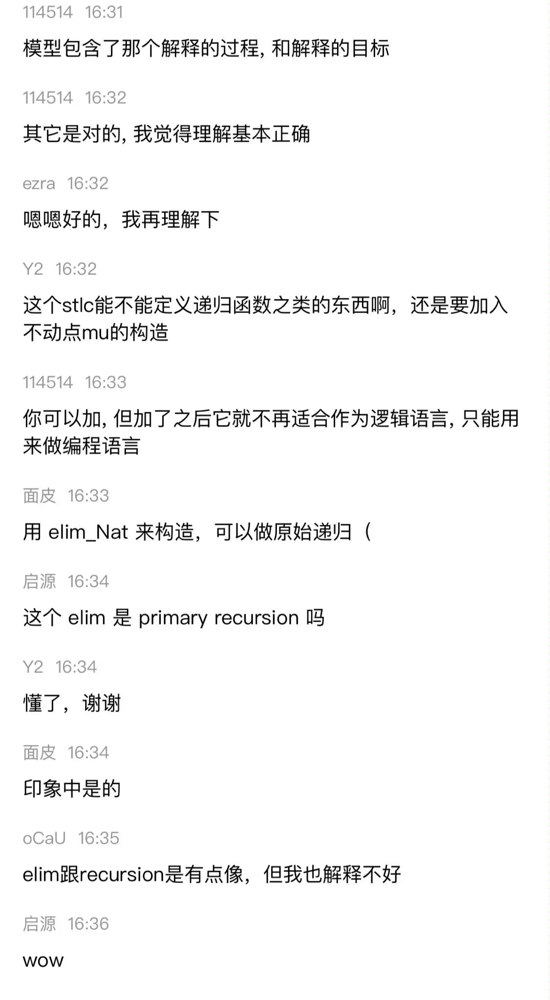

# ∞-type Café 暑期学校会议聊天记录OCR识别工具
> 本项目基于[TrWebOCR](https://github.com/alisen39/TrWebOCR)

## 效果

例如如下聊天记录截图:



可以生成[./demo.txt](./demo.txt):
```
| 
o- 16:31 114514 
| 模型包含了那个解释的过程,和解释的目标
o- 16:32 114514 
| 其它是对的,我觉得理解基本正确
o- 16:32 ezra
| 嗯嗯好的,我再理解下
o- 16:32 Y2
| 这个stlc能不能定义递归函数之类的东西啊,还是要加入
| 不动点mu的构造
o- 16:33 114514 
| 你可以加,但加了之后它就不再适合作为逻辑语言,只能用
| 来做编程语言
o- 16:33 面皮
| 用elim_Nat
| 来构造,可以做原始递归(
o- 16:34 启源
| 这个elim
| 是primary recursion吗
o- 16:34 Y2
| 懂了,谢谢
o- 16:34 面皮
| 印象中是的
o- 16:35 oCaU
| elim跟recursion是有点像,但我也解释不好
o- 16:36 启源
| WOW
```

## 使用
```
python3 main.py [screenshot_dir] [output_txt]
```

## 构建 || 运行

基于Python 3.6+， 经测试支持在以下平台运行:
- Ubuntu 16.04
- Ubuntu 18.04
- CentOS 7

或基于Docker:

使用 Dockerfile 构建 或者直接 Pull镜像  

- docker build
```shell script
docker build -t trwebocr:latest .
docker run -itd --rm -p 8089:8089 --name trwebocr trwebocr:latest 
```  

- docker pull
```shell script
docker pull mmmz/trwebocr:latest
docker run -itd --rm -p 8089:8089 --name trwebocr mmmz/trwebocr:latest 
``` 

## 文档
[接口文档](https://github.com/alisen39/TrWebOCR/wiki/%E6%8E%A5%E5%8F%A3%E6%96%87%E6%A1%A3)    

### 调用示例
这里以python为例：

``` python
import requests
url = 'http://localhost:8089/api/tr-run/'
img1_file = { 'file': open('img1.png', 'rb') }

res = requests.post(url=url, data={'compress': 1600}, files=img1_file)
```

- 也可使用Base64  
``` python
import requests
import base64

def img_to_base64(img_path):
    with open(img_path, 'rb')as read:
        b64 = base64.b64encode(read.read())
    return b64
    
url = 'http://localhost:8089/api/tr-run/'
img_b64 = img_to_base64('./img1.png')
res = requests.post(url=url, data={'img': img_b64, 'compress': 1600})
```
经过测试，`compress`的值最好设置为1600，否则可能出现无`raw_out`的问题

## 鸣谢
- [alisen39](https://github.com/alisen39) 和他的开源项目 [TrWebOCR](https://github.com/alisen39/TrWebOCR)
- [myhub](https://github.com/myhub) 和它的开源项目 [Tr](https://github.com/myhub/tr)

## License
[Apache 2.0](./LICENSE.txt)